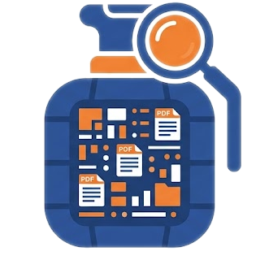
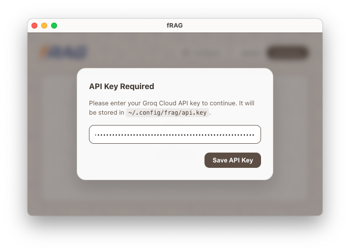
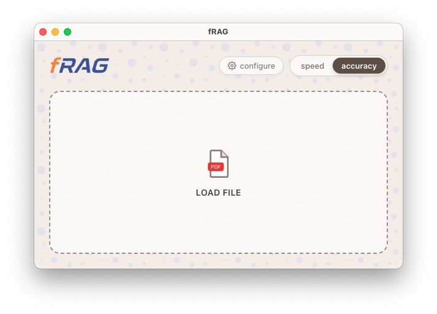
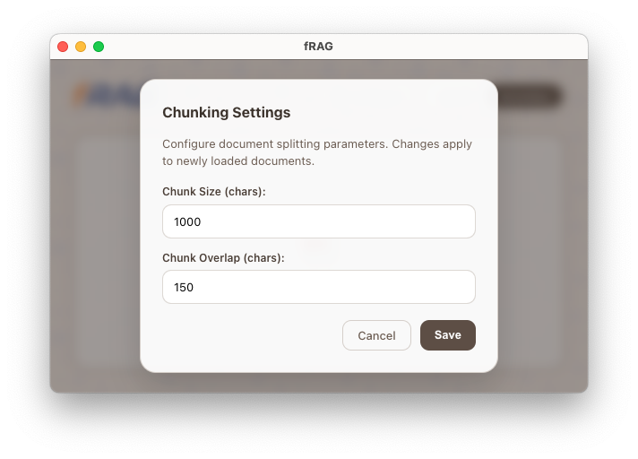
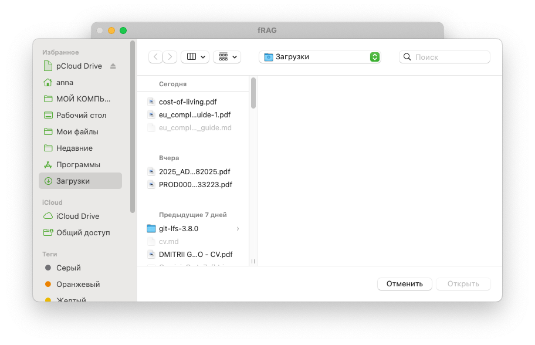
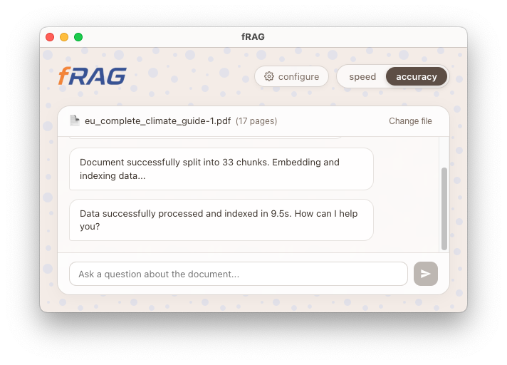
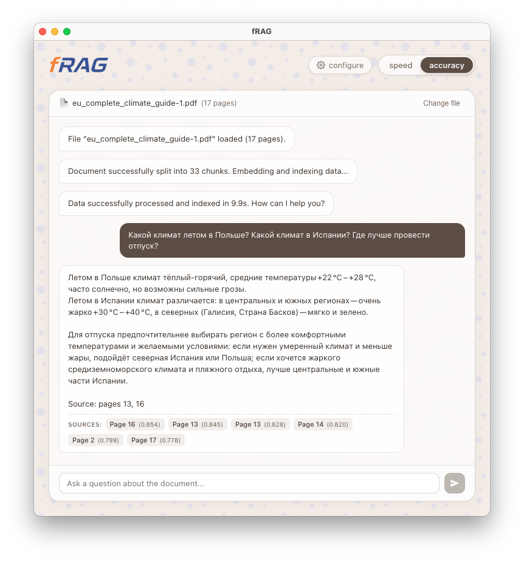

<p style="text-align:center;" align="center">
  
</p>

<h2 align="center">fRAG — Free Retrieval-Augmented Generation application for Mac, Linux and Windows</h2>

<p align="center">
  <strong>Fast, private, and customizable desktop RAG application powered by local CPU embeddings and Groq Cloud LLM — no GPU or paid services required.</strong>
</p>

<p align="center">
  <a href="#-key-features">Key Features</a> •
  <a href="#-overview--user-guide">Overview & User Guide</a> •
  <a href="#-tech-stack">Tech Stack</a> •
  <a href="#-getting-started">Getting Started</a> •
  <a href="#-building-from-source">Building from Source</a> •
  <a href="#-license">License</a>
</p>

---

## 🎯 Key Features

- **Zero Cloud & GPU Costs:** Designed to run 100% free of charge. No paid subscriptions, cloud vector databases, or high-end GPUs required — a standard [Groq Free Tier](https://console.groq.com/docs/rate-limits#rate-limits) account is sufficient.
- **Configurable Document Indexing:** Fine-tune chunk size and chunk overlap directly in the app to match the unique structure and density of your documents.
- **Local On-Device Embeddings:** Powered by quantized `multilingual-e5-small` running locally on your CPU via Transformers.js and ONNX Runtime.
- **Sentence-Level Multi-Query Retrieval:** Complex user inquiries are automatically split into discrete subqueries, retrieved concurrently, and deduplicated based on cosine similarity scores.
- **Multi-Turn Conversational Memory:** Retains dialogue context across interactions using a sliding buffer window, allowing natural follow-up questions.
- **Dual Inference Modes:** Instant toggle between **Speed** (`openai/gpt-oss-20b`) for lightning-fast responses and **Accuracy** (`openai/gpt-oss-120b`) for deep reasoning.

---

## 📸 Overview & User Guide

### 1. First Launch & API Key Configuration

Upon the initial launch, configure your Groq Cloud API key. The key is securely saved locally at `~/.config/frag/api.key` and never exposed to renderer processes. You can generate a free API key at [console.groq.com/keys](https://console.groq.com/keys).

<p align="center">
  
</p>

### 2. Ready for Document Ingestion

Once configured, the app presents a clean, minimalist workspace ready to accept PDF documents.

<p align="center">
  
</p>

### 3. Customizable Chunking Parameters

Click the **configure** gear button in the header to adapt the document splitting parameters to your document layout (e.g. smaller chunks `300-500` for precise clause lookups or larger chunks `1500-2000` for holistic paragraphs).

<p align="center">
  
</p>

### 4. File Selection

Click the dropzone area to open the native system file dialog and select your target PDF document.

<p align="center">
  
</p>

### 5. Automated Local Vectorization

The document is read, chunked, and embedded entirely on your CPU. Real-time indexing duration and chunk statistics are displayed in the chat interface.

<p align="center">
  
</p>

### 6. Complex Multi-Perspective Queries & Comparisons

Execute questions ranging from straightforward factual inquiries to complex multi-part queries requiring data comparison across distant sections of the document. Each response includes the relevant page citations and confidence scores.

<p align="center">
  
</p>

---

## 🛠 Tech Stack

| Component               | Technology                                   | Description                                                             |
| :---------------------- | :------------------------------------------- | :---------------------------------------------------------------------- |
| **Framework**           | [Electron][electron] + [electron-vite][vite] | Cross-platform desktop runtime and build tooling                        |
| **Frontend**            | [Svelte 5][svelte]                           | High-performance reactive UI with modern runes                          |
| **Document Processing** | [LangChain PDF Loader][langchain]            | Robust client-side PDF text extraction and recursive splitting          |
| **Embeddings**          | [Transformers.js][hf] + [ONNX Runtime][onnx] | Quantized `multilingual-e5-small` running locally on CPU                |
| **Vector Store**        | [LangChain MemoryVectorStore][langchain]     | In-memory cosine similarity indexing                                    |
| **LLM Inference**       | [Groq Cloud API][groq]                       | Ultra-fast LPU inference (`openai/gpt-oss-120b` & `openai/gpt-oss-20b`) |

[electron]: https://www.electronjs.org/
[vite]: https://electron-vite.org/
[svelte]: https://svelte.dev/
[langchain]: https://js.langchain.com/
[hf]: https://huggingface.co/docs/transformers.js
[onnx]: https://onnxruntime.ai/
[groq]: https://groq.com/

---

## 🚀 Getting Started

### Prerequisites

- [Node.js](https://nodejs.org/) (version 22 or higher)
- [Git](https://git-scm.com/) and [Git LFS](https://git-lfs.com/) (required to pull local ONNX model weights)

### Installation

1. **Clone the repository:**

   ```bash
   git clone https://github.com/ganochenkodg/frag.git
   cd frag
   ```

2. **Pull Git LFS assets:**

   ```bash
   git lfs pull
   ```

3. **Install dependencies:**
   ```bash
   npm install
   ```

### Running in Development Mode

```bash
npm run dev
```

---

## 📦 Building from Source

Package standalone distributables for your target platform:

```bash
# macOS (.dmg / .zip for Intel & Apple Silicon)
npm run build:mac

# Windows (.exe installer)
npm run build:win

# Linux (.AppImage / .deb)
npm run build:linux
```

Packaged installers and binaries will be generated in the `dist/` directory.

---

## 📄 License

This project is licensed under the MIT License — see the [LICENSE](LICENSE) file for details.
